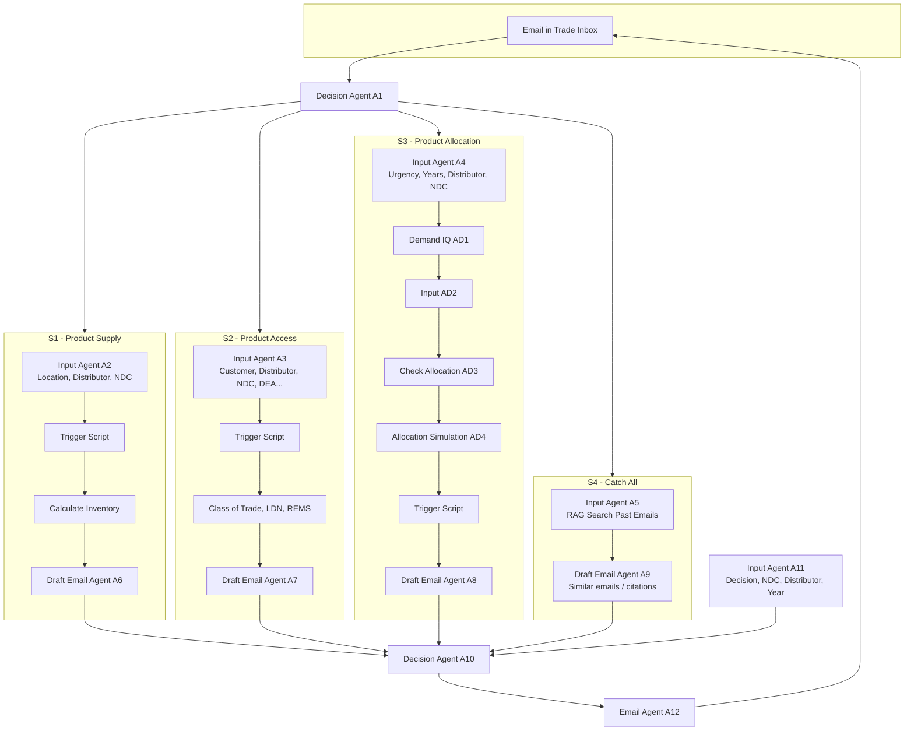
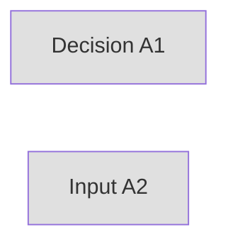
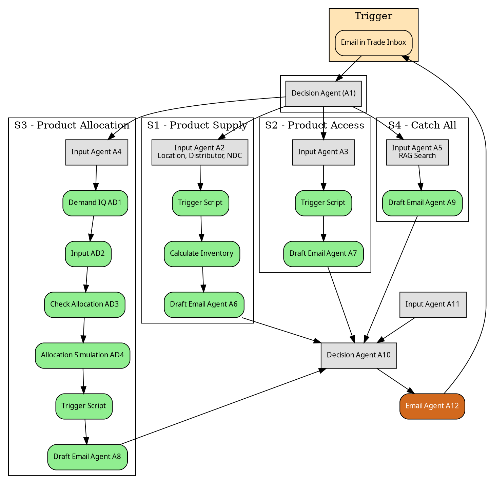

# Creating the Component Diagram from Code

You can reproduce the email automation component diagram (Decision A1 → S1–S4 branches → Input Agents → Trigger Scripts → Draft Agents → A10 → A12) entirely from code. Below are practical options and examples.

---

## 1. Mermaid (recommended: text → diagram)

**What it is:** A text-based diagram language. You write a code block; any Mermaid-capable viewer (GitHub, VS Code, Mermaid Live, Notion, etc.) renders it as a diagram.

**Pros:** Version-controllable, no image files, easy to edit, works in Markdown.  
**Cons:** Less control over exact pixel layout and colors than a design tool.

### Example: Email automation flow (matches your component diagram structure)



**How to view:** Paste the block (without the "mermaid" fence if your viewer needs only the content) into [Mermaid Live Editor](https://mermaid.live/) or a `.md` file in VS Code with a Mermaid extension.

**Styling (colors/shapes):** Use `classDef` and `linkStyle` in Mermaid, or use a theme. Example:



---

## 2. Graphviz (DOT)

**What it is:** A declarative graph language. You write a `.dot` file and render it with the `dot` CLI (or Python `graphviz` package) to PNG/SVG/PDF.

**Pros:** Very precise layout control, shapes, colors, labels, and industry-standard tooling.  
**Cons:** Separate render step; need Graphviz installed or a Python env.

### Example: Same flow in DOT

Save as `docs/component_flow.dot` and run: `dot -Tpng component_flow.dot -o component_flow.png`.



---

## 3. Python (generate Mermaid or DOT from code)

You can generate the same Mermaid or DOT from Python so the diagram stays in sync with your app (e.g. scenarios from config).

### Example: Print Mermaid from Python

```python
# scripts/generate_diagram.py (example)
def generate_mermaid():
    scenarios = [
        ("S1", "Product Supply", "A2", "Trigger Script → Calculate Inventory", "A6"),
        ("S2", "Product Access", "A3", "Trigger Script → Class of Trade, LDN, REMS", "A7"),
        ("S3", "Product Allocation", "A4", "AD1→AD2→AD3→AD4 → Trigger Script", "A8"),
        ("S4", "Catch All", "A5", "RAG Search", "A9"),
    ]
    lines = [
        "flowchart TB",
        "    INBOX[Email in Trade Inbox]",
        "    A1[Decision Agent A1]",
        "    INBOX --> A1",
    ]
    for sid, name, input_agent, mid, draft in scenarios:
        lines.append(f'    subgraph {sid}["{sid} - {name}"]')
        lines.append(f"        {input_agent}[Input Agent {input_agent}]")
        lines.append(f"        {draft}[Draft Email Agent {draft}]")
        lines.append(f"        {input_agent} --> {draft}")
        lines.append("    end")
        lines.append(f"    A1 --> {input_agent}")
    lines.extend([
        "    A6 --> A10; A7 --> A10; A8 --> A10; A9 --> A10",
        "    A11[Input Agent A11] --> A10[Decision Agent A10]",
        "    A10 --> A12[Email Agent A12]",
        "    A12 --> INBOX",
    ])
    return "\n".join(lines)

if __name__ == "__main__":
    print(generate_mermaid())
```

Run: `python scripts/generate_diagram.py`. Paste the output into a Mermaid viewer or a `.md` file inside a ` ```mermaid ` block.

---

## 4. ASCII (no renderer)

Pure text diagrams (e.g. in `CORE_WORKFLOW.md`) work in any editor or terminal. You don’t need any tool; just align boxes and arrows with spaces and characters. Good for quick sketches and docs that must be readable as plain text.

---

## Summary

| Method        | Output        | Best for                          |
|---------------|---------------|------------------------------------|
| **Mermaid**   | Rendered diagram from text | Markdown, GitHub, VS Code, quick edits |
| **Graphviz**  | PNG/SVG/PDF   | Precise layout, colors, print/export |
| **Python**    | Mermaid or DOT string | Keeping diagram in sync with code/config |
| **ASCII**     | Plain text    | No tools, terminals, simple flows   |

**Practical path:** Keep the diagram as **Mermaid** in a `.md` file (or generate it with a small **Python** script from your scenario config), and use **Graphviz** only if you need a pixel-perfect or printable image matching your original component diagram style.
