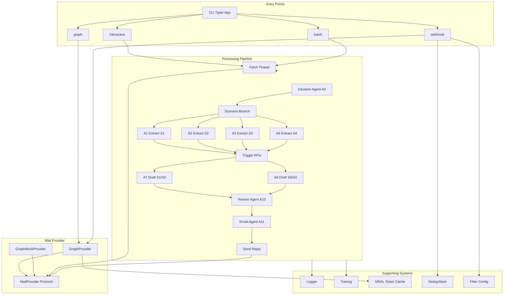

# File Manifest

A guide to every file, folder, module, class, and function in the email-automation project.

---

## 1. Project Overview

This project is a **multi-agent email automation system** for pharmaceutical trade operations. It ingests incoming emails (from mock JSON/CSV or Microsoft Graph API), classifies each thread into one of four scenarios (Product Supply, Product Access, Product Allocation, or Catch-All), extracts structured data via LLM agents, calls scenario-specific mock APIs (inventory, access, allocation, RAG), drafts and reviews reply content with AI agents, and optionally sends the reply via a configurable mail provider. It supports interactive, batch, Graph, and webhook CLI modes, with structured logging and Phoenix/OpenTelemetry tracing.

---

## 2. Architecture / Data-Flow Diagram



---

## 3. Directory Tree

```
email-automation/
├── .gitignore
├── pyproject.toml
├── README.md
├── uv.lock
├── config/
│   ├── filter.example.json
│   └── filter.json
├── docs/
│   ├── AZURE_SETUP_GUIDE.md
│   ├── component_diagram.jpg
│   ├── FILTER_CONFIG.md
│   ├── CORE_WORKFLOW.md
│   ├── FILE_MANIFEST.md
│   ├── GRAPH_API_INTEGRATION_GUIDE.md
│   ├── IMPLEMENTATION_STATUS.md
│   └── WEBHOOK_DEV_TUNNEL_SETUP.md
├── scripts/
│   └── verify_graph_credentials.py
├── src/
│   ├── __init__.py
│   ├── main.py
│   ├── config.py
│   ├── orchestrator.py
│   ├── agents/
│   │   ├── __init__.py
│   │   ├── base.py
│   │   ├── decision_agent.py
│   │   ├── draft_agents.py
│   │   ├── email_agent.py
│   │   ├── input_agents.py
│   │   └── review_agent.py
│   ├── auth/
│   │   ├── __init__.py
│   │   └── token_cache.py
│   ├── cli/
│   │   ├── __init__.py
│   │   ├── batch_mode.py
│   │   ├── graph_mode.py
│   │   ├── interactive_mode.py
│   │   ├── shared.py
│   │   └── webhook_mode.py
│   ├── mail_provider/
│   │   ├── __init__.py
│   │   ├── graph_mock.py
│   │   ├── graph_models.py
│   │   ├── graph_real.py
│   │   ├── mapping.py
│   │   └── protocol.py
│   ├── models/
│   │   ├── __init__.py
│   │   ├── data.py
│   │   ├── email.py
│   │   ├── inputs.py
│   │   └── outputs.py
│   ├── triggers/
│   │   ├── __init__.py
│   │   ├── access_api.py
│   │   ├── allocation_api.py
│   │   ├── inventory_api.py
│   │   └── rag_search.py
│   ├── utils/
│   │   ├── __init__.py
│   │   ├── body_sanitizer.py
│   │   ├── csv_loader.py
│   │   ├── email_parser.py
│   │   ├── logger.py
│   │   ├── observability.py
│   │   └── tracing.py
│   └── webhook/
│       ├── __init__.py
│       ├── dedup_store.py
│       ├── filter_config.py
│       ├── models.py
│       ├── server.py
│       └── subscription.py
└── tests/
    ├── __init__.py
    └── test_dedup_store.py
```

---

## 4. File-by-File Manifest

### Root

| File | Purpose |
|------|--------|
| **pyproject.toml** | Project metadata, dependencies, and hatch build config; defines `email-automation` console script. |
| **README.md** | Project overview, features, architecture, quick start, config, run modes, and tech stack. |
| **.gitignore** | Ignores venv, .env, __pycache__, data/, output/, logs/, dedup_state.json. |
| **uv.lock** | Locked dependency versions for the uv package manager. |

---

### config/

| File | Purpose |
|------|--------|
| **filter.json** | Webhook allowed-senders list (JSON array); only notifications from these addresses trigger processing. |
| **filter.example.json** | Example template for filter config with sample sender addresses. |

---

### docs/

| File | Purpose |
|------|--------|
| **AZURE_SETUP_GUIDE.md** | Step-by-step Azure AD app registration and Graph API permissions for delegated/application auth. |
| **component_diagram.jpg** | Visual component diagram image. |
| **FILTER_CONFIG.md** | Allowed-senders filter format and REST API for managing senders. |
| **FILE_MANIFEST.md** | This file: manifest of all files, modules, classes, and functions. |
| **CORE_WORKFLOW.md** | Core workflow: high-level pipeline and per-scenario (S1–S4) flow with ASCII diagrams. |
| **GRAPH_API_INTEGRATION_GUIDE.md** | Python Graph API integration: auth, read/send mail, models, error handling, examples. |
| **IMPLEMENTATION_STATUS.md** | Feature completion status, architecture summary, roadmap, and limitations. |
| **WEBHOOK_DEV_TUNNEL_SETUP.md** | Microsoft Dev Tunnel setup for local webhook development and subscription lifecycle. |

---

### scripts/

| File | Purpose |
|------|--------|
| **verify_graph_credentials.py** | Verifies Azure Graph API credentials (delegated or application mode). |
| **Functions** | |
| `verify_delegated()` | Runs device-code flow and tests Graph access. |
| `verify_application()` | Runs client-secret auth and tests Graph access. |

---

### src/ (core)

| File | Purpose |
|------|--------|
| **__init__.py** | Package marker for `src`. |
| **main.py** | Entry point; delegates to CLI app (`src.cli.app`). |
| **config.py** | Centralized configuration from environment variables. |
| **Classes / Functions** | |
| (module-level constants) | PROJECT_ROOT, DATA_DIR, OUTPUT_DIR, INBOX_PATH, SENT_ITEMS_PATH, OPENAI_API_KEY, LOG_DIR, LOG_FILE, LOG_LEVEL, VERBOSE_LOGGING, PHOENIX_*, TARGET_SENDER, WEBHOOK_*, DEDUP_*, etc. |
| **orchestrator.py** | Orchestrates the full email workflow: fetch thread, A0 → branch → A7/A8 → A10 → A11 → send. |
| **Functions** | |
| `_maybe_await()` | Awaits coroutines or returns sync values (for provider compatibility). |
| `process_trigger()` | Entry point: fetches thread by message_id/conversation_id, runs pipeline, sends reply. |
| `process_email_thread()` | Runs decision → input extraction → trigger API → draft → review → format → send with tracing. |

---

### src/models/

| File | Purpose |
|------|--------|
| **__init__.py** | Package marker; re-exports model types. |
| **email.py** | Domain models for a single email and a thread. |
| **Classes** | |
| `Email` | Single message: id, sender, subject, body, timestamp, thread_id, sender_name. |
| `EmailThread` | Thread of emails: thread_id, emails list, latest_email. |
| **inputs.py** | Pydantic models for scenario-specific extracted inputs. |
| **Classes** | |
| `ProductSupplyInput` | S1: location, distributor, ndc, confidence, missing_fields. |
| `ProductAccessInput` | S2: customer, distributor, ndc, dea_number, address, is_340b, contact, confidence, missing_fields. |
| `ProductAllocationInput` | S3: urgency, year_start, year_end, distributor, ndc, confidence, missing_fields. |
| `CatchAllInput` | S4: topics, question_summary, confidence, missing_fields. |
| **outputs.py** | Pydantic models for agent outputs and end-to-end result. |
| **Classes** | |
| `ScenarioDecision` | A0 output: scenario (S1–S4), confidence, reasoning. |
| `DraftEmail` | A7/A8 output: subject, body, scenario, metadata. |
| `ReviewResult` | A10 output: status, confidence, quality_score, accuracy_notes, suggestions. |
| `FinalEmail` | A11 output: to, subject, body, review_status, metadata. |
| `ProcessingResult` | Full result: thread_id, scenario, decision_confidence, draft, review, final_email, raw_data. |
| **data.py** | Pydantic models for mock/CSV data used by trigger APIs. |
| **Classes** | |
| `InventoryRecord` | S1: ndc, product_name, location, quantity_available, distributor. |
| `CustomerRecord` | S2: customer_id, name, dea_number, is_340b, class_of_trade, address, rems_certified. |
| `AllocationRecord` | S3: distributor, ndc, allocation_percent, year, quantity_allocated, quantity_used. |
| `ProductRecord` | Product catalog: ndc, brand_name, description. |
| `PastEmailRecord` | RAG/S4: email_id, subject, body, topic. |

---

### src/agents/

| File | Purpose |
|------|--------|
| **__init__.py** | Package marker; re-exports agents and run functions. |
| **base.py** | Factory for Pydantic AI agents with shared config (OpenAI GPT-4o-mini, retries). |
| **Functions** | |
| `create_agent()` | Creates a Pydantic AI agent from name, system prompt, and optional kwargs. |
| **decision_agent.py** | Agent A0: classifies email thread into scenario S1/S2/S3/S4. |
| **Functions** | |
| `_thread_to_prompt()` | Builds prompt text from thread for the decision agent. |
| `classify_thread()` | Returns ScenarioDecision (scenario, confidence, reasoning). |
| **input_agents.py** | Agents A1–A4: extract structured inputs per scenario. |
| **Functions** | |
| `_thread_prompt()` | Builds thread summary for input agents. |
| `extract_supply()` | A1: extracts ProductSupplyInput for S1. |
| `extract_access()` | A2: extracts ProductAccessInput for S2. |
| `extract_allocation()` | A3: extracts ProductAllocationInput for S3. |
| `extract_catchall()` | A4: extracts CatchAllInput for S4. |
| **draft_agents.py** | Agents A7, A8: generate draft reply emails. |
| **Functions** | |
| `draft_supply_or_access()` | A7: drafts reply for S1 or S2 from inputs and trigger data. |
| `draft_allocation_or_catchall()` | A8: drafts reply for S3 or S4 from inputs and trigger data. |
| **review_agent.py** | Agent A10: quality check and accuracy verification of draft. |
| **Functions** | |
| `review_draft()` | Returns ReviewResult (approved/needs_human_review, confidence, notes, suggestions). |
| **email_agent.py** | Agent A11: final formatting and output generation. |
| **Functions** | |
| `format_final_email()` | Produces FinalEmail; adds human-review header if flagged, personalizes with sender name. |

---

### src/mail_provider/

| File | Purpose |
|------|--------|
| **__init__.py** | Package marker; re-exports provider types and mapping. |
| **protocol.py** | Abstract interface for mail operations. |
| **Classes** | |
| `MailProvider` | Protocol: get_message(), get_conversation(), reply_to_message(). |
| **graph_models.py** | Pydantic models for Microsoft Graph message and send payload. |
| **Classes** | |
| `EmailAddress` | address, name. |
| `Recipient` | emailAddress (EmailAddress). |
| `ItemBody` | contentType, content. |
| `GraphMessage` | Graph message resource: id, conversationId, subject, body, from_, toRecipients, etc. |
| `SendPayload` | Payload for sending: to, subject, body, contentType, conversationId, internetMessageId. |
| **graph_mock.py** | Mock provider: reads inbox from JSON, writes sent items to JSON. |
| **Classes** | |
| `GraphMockProvider` | Implements MailProvider using local JSON files. |
| **Methods** | get_message(), get_conversation(), list_conversations(), reply_to_message(). |
| **graph_real.py** | Real Microsoft Graph API provider with retries and subscription support. |
| **Classes** | |
| `GraphProvider` | Implements MailProvider; delegated auth via MSAL token cache. |
| **Methods** | get_message(), get_conversation(), reply_to_message(), send_message(), create_subscription(), renew_subscription(), delete_subscription(), get_latest_from_sender(). |
| **Functions** | _is_transient_network_error(), _is_throttle_error(), _throttle_retry_delay_seconds(), _convert_sdk_message(). |
| **mapping.py** | Converts between Graph messages and domain models / send payload. |
| **Functions** | |
| `_parse_datetime()` | Parses Graph datetime strings. |
| `_sender_address()` | Extracts sender email from GraphMessage. |
| `_sender_name()` | Extracts sender display name from GraphMessage. |
| `graph_messages_to_thread()` | Converts list of GraphMessage to EmailThread (sanitizes body). |
| `final_email_to_send_payload()` | Builds SendPayload from FinalEmail and reply context. |

---

### src/triggers/

| File | Purpose |
|------|--------|
| **__init__.py** | Package marker; re-exports trigger functions. |
| **inventory_api.py** | Mock Inventory API for S1 (852/Value Track style). |
| **Functions** | |
| `_parse_inventory_rows()` | Parses CSV rows into InventoryRecord list. |
| `inventory_api_fetch()` | Returns inventory data dict filtered by NDC, distributor, location. |
| **access_api.py** | Mock Access API for S2 (class of trade, REMS). |
| **Functions** | |
| `_parse_bool()` | Parses boolean from CSV/API values. |
| `access_api_fetch()` | Returns customer/access data dict matched by DEA or customer name. |
| **allocation_api.py** | Mock Allocation API for S3 (DCS-style). |
| **Functions** | |
| `allocation_api_simulate()` | Returns allocation data dict filtered by NDC, distributor, year range. |
| **rag_search.py** | Mock RAG search for S4 (similar past emails). |
| **Functions** | |
| `rag_search_find_similar()` | Returns similar past emails dict by topics/question summary. |

---

### src/utils/

| File | Purpose |
|------|--------|
| **__init__.py** | Package marker; re-exports logger, tracing, loaders, etc. |
| **logger.py** | Structured logging with Structlog (console + JSONL file). |
| **Functions** | |
| `_coerce_level()` | Converts level name to logging constant. |
| `_configure_logging()` | Sets up handlers and formatters. |
| `get_logger()` | Returns bound logger with optional bindings. |
| `bind_context()` | Binds key-value context to global logger. |
| `unbind_context()` | Removes context keys. |
| `clear_context()` | Clears all context. |
| `log_agent_step()` | Logs agent step with name, step, and optional data. |
| **tracing.py** | Phoenix/OpenTelemetry tracing setup. |
| **Functions** | |
| `_resolve_protocol()` | Resolves Phoenix protocol from env. |
| `_resolve_endpoint()` | Resolves collector endpoint URL. |
| `init_tracing()` | Initializes OTEL tracer provider and Pydantic AI instrumentation. |
| `get_tracer()` | Returns OpenTelemetry tracer. |
| **observability.py** | Helpers for span attributes and PII-safe previews. |
| **Functions** | |
| `thread_preview_for_observability()` | Builds PII-redacted thread preview for traces. |
| **body_sanitizer.py** | Email body sanitization pipeline (HTML→text, banners, quotes, signatures, PII, truncation). |
| **Functions** | html_to_text(), remove_security_banners(), remove_quoted_replies(), remove_signatures(), normalize_whitespace(), decode_special_characters(), truncate_long_content(), truncate_at(), redact_pii(), sanitize_email_body(), sanitize_for_observability(). |
| **Pipelines** | DEFAULT_PIPELINE, MINIMAL_PIPELINE, AGGRESSIVE_PIPELINE, OBSERVABILITY_PIPELINE. |
| **email_parser.py** | Parse email CSV rows and build threads. |
| **Functions** | |
| `parse_email_csv_row()` | Parses a CSV row dict into Email. |
| `build_threads()` | Groups emails by thread_id into list of EmailThread. |
| **csv_loader.py** | Load mock data from CSV files. |
| **Functions** | |
| `_read_csv()` | Reads CSV file to list of dicts. |
| `load_emails_csv()` | Loads emails from CSV. |
| `load_inventory()` | Loads inventory CSV. |
| `load_customers()` | Loads customers CSV. |
| `load_allocations()` | Loads allocations CSV. |
| `load_products()` | Loads products CSV. |
| `load_past_emails()` | Loads past emails CSV for RAG. |

---

### src/cli/

| File | Purpose |
|------|--------|
| **__init__.py** | Typer app setup; registers interactive, batch, graph, webhook commands; initializes tracing. |
| **Functions** | |
| `register_commands()` | Registers all CLI commands with the Typer app. |
| **shared.py** | Shared CLI helpers: console, logger, output paths, result formatting. |
| **Functions** | |
| `get_mock_provider()` | Returns GraphMockProvider for given inbox/sent paths. |
| `ensure_output_dirs()` | Creates output directories. |
| `write_json_result()` | Writes result dict to JSON file. |
| `append_csv_log_row()` | Appends a CSV log row. |
| `result_to_serializable()` | Converts ProcessingResult to dict. |
| `print_result()` | Prints result to console. |
| `processing_log_row()` | Builds CSV row dict from ProcessingResult. |
| **interactive_mode.py** | Interactive mode: list conversations, pick one, process and send. |
| **Functions** | |
| `interactive()` | Runs interactive loop with Rich table and user selection. |
| **batch_mode.py** | Batch mode: process all conversations in inbox. |
| **Functions** | |
| `batch()` | Processes all conversations; writes JSON and CSV results. |
| **graph_mode.py** | Graph mode: process latest email from sender via real Graph API. |
| **Functions** | |
| `graph()` | Fetches latest from sender, shows draft for confirmation, then sends. |
| **webhook_mode.py** | Webhook mode: run FastAPI listener for Graph change notifications. |
| **Functions** | |
| `webhook()` | Starts webhook server; optionally creates Graph subscription. |

---

### src/auth/

| File | Purpose |
|------|--------|
| **__init__.py** | Package marker. |
| **token_cache.py** | MSAL token cache for persistent delegated auth (device code flow). |
| **Classes** | |
| `MSALDelegatedCredential` | TokenCredential implementation with file-based token cache. |
| **Functions** | |
| `_ensure_cache_dir()` | Ensures cache directory exists. |
| `_load_cache()` | Loads token cache from disk. |
| `_save_cache()` | Saves token cache to disk. |
| `get_persistent_device_code_credential()` | Returns TokenCredential with persistent cache. |

---

### src/webhook/

| File | Purpose |
|------|--------|
| **__init__.py** | Package marker; re-exports server, models, subscription, dedup, filter. |
| **models.py** | Pydantic models for Graph change notifications. |
| **Classes** | |
| `ResourceData` | Resource data in notification: odata_type, id. |
| `ChangeNotification` | Single change notification: change_type, client_state, resource, resource_data, subscription_id, etc. |
| `ChangeNotificationBatch` | Request body: value (list of ChangeNotification). |
| **server.py** | FastAPI webhook server: validation, notification handler, worker pool, dedup, allowed-senders filter. |
| **Functions** | |
| `_parse_notification_resource()` | Extracts message_id and user_id from notification. |
| `_run_process_trigger()` | Runs process_trigger in background. |
| `_process_notification_message()` | Processes one message with retries, sender filter, dedup. |
| `_notification_worker()` | Worker loop: consumes queue, processes notifications. |
| `_setup_workers()` | Creates queue and worker pool. |
| `_setup_provider()` | Creates GraphProvider and subscription manager. |
| `_shutdown_tasks()` | Shuts down workers and closes connections. |
| `_lifespan()` | FastAPI lifespan: setup provider, workers; shutdown. |
| `create_app()` | Creates FastAPI app with routes and lifespan. |
| **Endpoints** | GET/POST /webhook/notifications, GET /health, GET/POST/DELETE /webhook/allowed-senders, POST /webhook/allowed-senders/reload. |
| **subscription.py** | Graph subscription lifecycle. |
| **Functions** | |
| `create_subscription()` | Creates webhook subscription. |
| `renew_subscription()` | Renews subscription expiration. |
| `delete_subscription()` | Deletes subscription. |
| `list_subscriptions()` | Lists current subscriptions. |
| **dedup_store.py** | Persistent deduplication store for webhook notifications. |
| **Classes** | |
| `DedupStore` | Thread-safe store: triggered IDs, conversation cooldown, in-flight, failed IDs with TTL. |
| **Methods** | has_triggered(), mark_triggered(), is_processing(), add_processing(), remove_processing(), mark_failed(), has_failed(), has_recent_reply(), mark_replied(). |
| **filter_config.py** | Allowed-senders filter: load/save JSON, validate and normalize emails. |
| **Functions** | |
| `get_filter_config_path()` | Returns path to filter config (env override supported). |
| `is_valid_email()` | Validates email format. |
| `_normalize_email()` | Normalizes email for comparison. |
| `_parse_config()` | Loads and parses config file. |
| `load_allowed_senders()` | Returns list of allowed sender addresses. |
| `save_allowed_senders()` | Saves allowed senders to JSON. |

---

### tests/

| File | Purpose |
|------|--------|
| **__init__.py** | Package marker for tests. |
| **test_dedup_store.py** | Unit tests for DedupStore. |
| **Tests** | test_triggered_persistence, test_conversation_cooldown, test_processing_in_flight, test_mark_triggered_atomic. |

---

## 5. Scenario Quick Reference

| Scenario | Name            | Input Agent | Trigger API           | Draft Agent |
|----------|-----------------|-------------|------------------------|-------------|
| S1       | Product Supply  | A1          | inventory_api_fetch    | A7          |
| S2       | Product Access  | A2          | access_api_fetch       | A7          |
| S3       | Product Allocation | A3        | allocation_api_simulate| A8          |
| S4       | Catch-All       | A4          | rag_search_find_similar| A8          |

After drafting, all scenarios flow through **Review Agent A10** and **Email Agent A11**, then send via the configured **MailProvider**.
